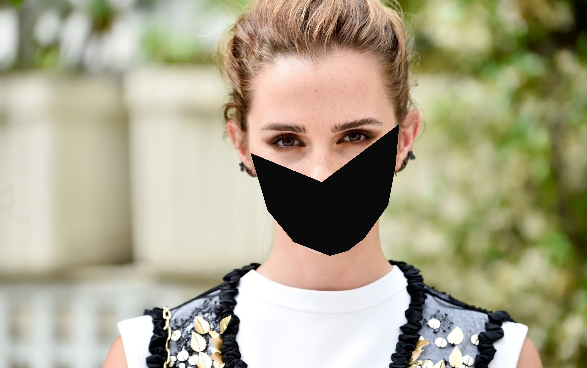

# Put-a-face-mask-on-an-image
This is a simple python program that helps you detect a face in a picture and put on a face mask on it

I have used opencv and dlib to help with face detection and drawing a mask on the face

I am generating a data set with face masks on people and i thought this little but useful function will be of great help in the upcoming days of research on the COVID-19

See the following example

